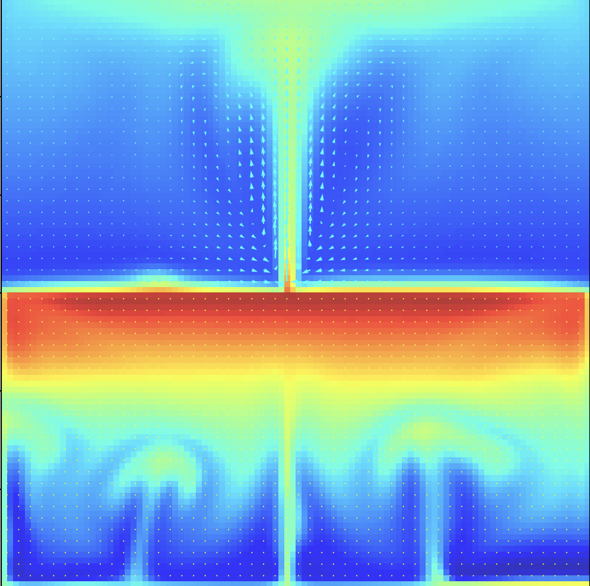

# Navier-Stokes and Heat Equation Finite Difference Solver

The following repository contains scripts for solving and validating the incompressible Navier-Stokes equations using the finite difference / finite volume method. The finite volume method was originally intended, but because of the structured mesh, this method simplifies to be no different than the finite difference method. The intermediate velocities are solved for, then corrected later after solving for the pressure gradient. Each .py file contains a thorough summary of the script and problem statement.

## Results

## Contents

[1d_advection_diffusion.py](#1d_advection_diffusionpy)  
[2d_convection.py](#1d_advection_diffusionpy)  
[2d_heat_transfer_flow.py](#1d_advection_diffusionpy)  
[Couette_validation.py](#Couette_validationpy)  
[Poiseuille_validation.py](#Poiseuille_validationpy)  
[supporting_mathematics.py](#supporting_mathematicspy)  

## References

Professor Tony Saad (YouTube): https://www.youtube.com/@ProfessorSaadExplains
